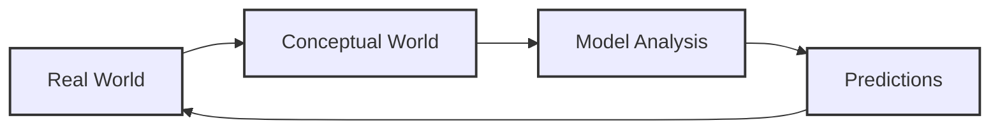
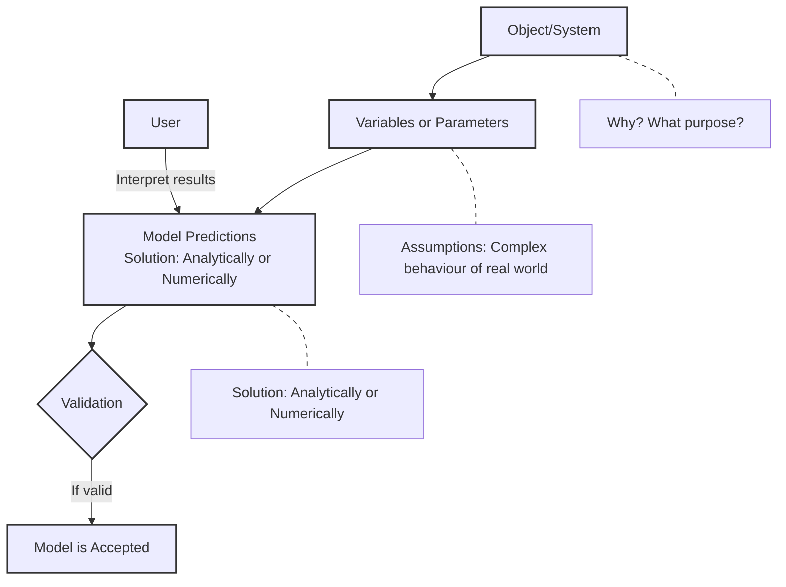
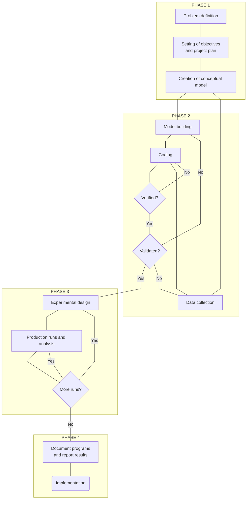
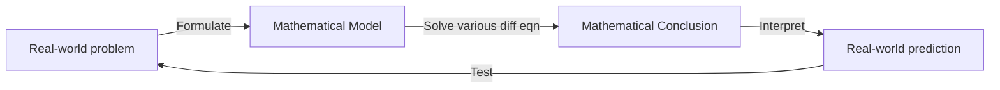
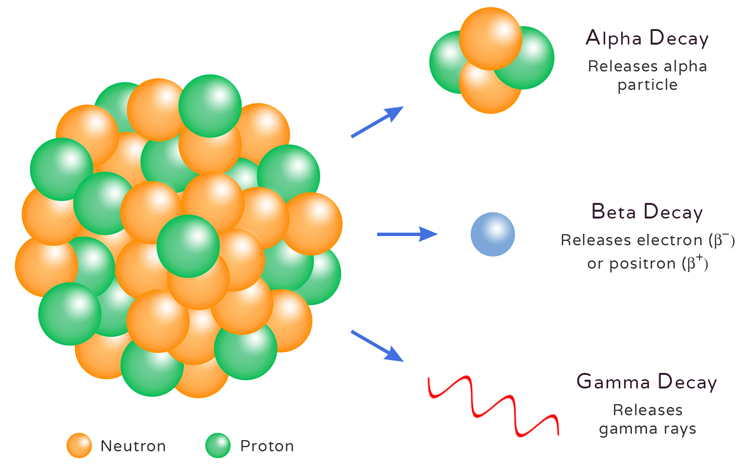
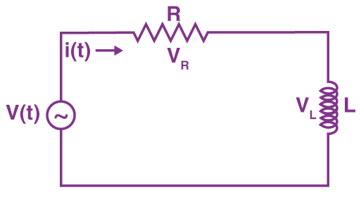

# Unit 1: Introduction to Simulation

## Simulation  
The process of designing a mathematical or logical model of a real system and then conducting computer-based experiments with the model to describe, explain, and predict the behavior of the real system.

## System  
A group of objects that are joined together in some regular interactions or interdependencies towards the accomplishment of a specific goal.

### Components of a System  
1. Entity  
2. Attribute  
3. Activity  
4. State  
5. Event  
   - **Endogenous**: arising from internal structure or functional cause  
   - **Exogenous**: having an external cause or origin  

## System Environment  
Changes occurring outside the system.

## General Simulation Language  
1. **GPS**  
   - Block structure language  
   - Interpreting execution  
   - FORTRAN-based (helps to create blocks)  
   - World View: transactions/facilities  

2. **SIMScript 11.5**  
   - English-like problem descriptive language  
   - Compiled programs  
   - Complete language (no other underlying language)  
   - World View: processes, resources  

3. **MODSIM III Modern Object-Oriented Language**  
   - Modular, compiled program  
   - Based on Modula-2  
   - World View: processes  

4. **SIMULA**  
   - ALGOL-based problem descriptive language  
   - Compiled programs  
   - World View: processes  

5. **SLAM Block-Based Language**  
   - Interpretive execution  
   - FORTRAN-based (and extended)  
   - World View: network/event/process  

6. **CSIM**  
   - Process-oriented language  
   - C-based (C++ compatible)  
   - World View: processes  


## Examples of systems and Components

System|Entity|Attribute|Activities|Events|State Variables|
------|------|---------|----------|------|---------------|
Banking|Customer|Account Balance|Making Deposit|Arrival and Departure|Number of customers waiting|

## Types of System
1. Discrete System
2. Continuous System

### Discrete System 
- State variables change only at a discrete set of points in time

   Example: Bank -> The number of csutomers changes only when a customer arrives or when the service provided to the customer is completed.

### Continuous System 
- State variables change continuously over time

   Example: Head of the water behind a dam


## Model 
- A representation of a system for the purpose of studying the system 
- A simplification of the system 
- Sufficiently detailed to permit valid conclusions to be drawn about the real system

### Types of Model
**1. Static or Dynamic Simulation Models**

- Static Simulation Model (called Monte Carlo Simulation) represents a system at a particular point in time

- Dynamic Simulation Models represent systems as they change over time

**2. Deterministic and Stoichastic Simulation Models**

- Deterministic Simulation Models contain no random variables and have a known set of inputs which will result in a unique set of outputs.

- Stoichastic Simulation Models have one or more random varibales as inputs. Random input lead to random output. 


## Model of a system
A model is defined as a representation of a system for the purpose os studying the system.  
The various types of models are:
- Mathematical Model ot Physical Model
- Static Model
- Dynamic Model
- Deterministic Models
- Stoichastic Model 
- Discrete Model

### 1. Mathemtical Model 
Use symbolic notation and the mathematical equations to represent a system  

### 2. Static Model  
Represents a system at a particular point of time and also known as Monte-Carlo Simulation

### 3. Dynamic Model 
Represents systems as they change over time. Example: Simulation of a bank  

### 4. Deterministic Model
Contains no random variables. They have a known set of inputs which will result in a unique set of outputs. 
Example: Arrival of patients at a Dentist at the scheduled appointment time.

### 5. Stoichastic Model 
Has one or more random variables as input.  
Random inputs lead to random output.  
Example: Simulation of a block involves random interarrival and service time.  

### 6. Discrete Event Simulation
Modelling of a system in which the state variables changes only at a discrete set of points in time.    
THe simulation models are analyzed by numerical rather than by analytical methods.

## The Modelling Cycle



## Principles of Mathematical Model




## Applications of Simulation
- Epidemiology
- Biological Transport
- Vehicular traffic
- Optimal Strategies in business
- Economic
- Financial Industry
- Engineering
- Software Development

## Phases/Steps in Simulation Study




## Summary-Simulation Study Steps

1. Problem Formulation  
a. Define the problem  
b. Define the system  
c. Establish performance metrics  
d. Build conceptual model  
e. Document model assumptions

2. Simulation Model Building  
a. Model translation  
b. Input data modelling  
c. Verification  
d. Validation  

3. Experimental Design and Analysis  
a. Preliminary runs  
b. Final experiments  
c. Analysis of results  

4. Evaluate and Iterate  
a. Documentation  
b. Model manual  
c. User manual  

5. Implementation  
Puts to the production of simulation


## Use of Differential and Partial Differential Equation in Modeling:

### **Modeling:**
- A mathematical model is an expression involving variables, functions or equations that represents a real-world phenomenon.
- The purpose of a model is to understand a certain phenomenon and to make predictions about the future behaviour or outcomes of a system, event or quantity.
- The figure below illustrates the modeling process:

---

**_Example 1:_ RadioActive Decay**

Experiment shows that at each instant a radio-active substance decomposes, the rate of decomposition is propotional to the amount of substance present. Given a certain initial amount of a radioactive substance present at any time later.
```math
\text{Let, y = amount of substance present at any given time} \\
\text{y}_0 = \text{initial amount of substance} \\ \space \frac{\text{dy}}{\text{dt}} \space \alpha \space \text{y} \\
\text{Working Equation:} \space
\frac{\text{dy}}{\text{dt}} = -k\text{y}; \text{where} \space k \space \text{is propotionality decay constant}
```
<div align= "center">
   
   <p><b>Fig 01:</b><i> Diagram illustrating Radioactive decay</i></p>
</div>

---
**_Example 2:_ A freely falling body**

An object is falling under the influence of gravity as it falls downward. It is subjected to air resistance that creates an upward force propotional to the velocity of object. Obtain the differential equation that describes the velocity and the position of the object at any given time. Assume that the mass of body as $m$
and acceleration due to gravity $g$ — which is constant throughout the planet.

<div align="center">
   
   <p><b>Fig 02:</b> <i>Example_2 diagram</i></p>
</div>

Applying relevant physical law; **Newtons Law of acceleration**:_(2nd Law)_
```math
F_{net} = ma
```
Substituting forces:
```math
mg- kv = ma
```
Then, substiuting $a$ with $\frac{dv}{dt}$; we get:

```math
mg - kv = m \frac{dv}{dt}
```

Rearranging terms:
Dividing through by $m$:
```math
g- \frac{k}{m} v= \frac{dv}{dt}
```
On reagrranging: we get
```math
\frac{dv}{dt} + \frac{k}{m} v = g
```
This represents the first order diffrential equation.

Likewise, the second order differential equation would look like:
```math
\frac{dv^2}{dt^2} + \frac{k}{m} \frac{dy}{dt} = g
```
---
**_Example 3:_** RL Circuit

A series RL circuit connected in a voltage source $V$ develops a model of circuit describing the circuit at any time $ t > 0$

<div align="center">
   
   <p><b>Fig 03:</b><i> RL Circuit</i></p>
</div>

Kirchoff's Voltage Law (KVL):
```math
V- iR - L \frac{di}{dt} = 0 \\  
or, L \frac{di}{dt} + iR = V \\  
or \frac{di}{dt} + \frac{R}{L}i = \frac{V}{L}  
```
describes current at any time t and is a **differential equation of first degree.**


## Simulation Software

- [Arena](www.arenasimulation.com)
- [Automod](www.automod.com)
- [Delmia/Quest](www.delmia.com)
- [Extend](www.rockwellautomation.com/en-us/products/software/extend-simulations)
- [Flexim](www.flexsim.com)
- [MicroSim](www.microsim.com)
- [ProModel](www.promodel.com)
- [Simula](www.simula.no)
- [WITNESS](www.lanner.com/products/witness) 

---