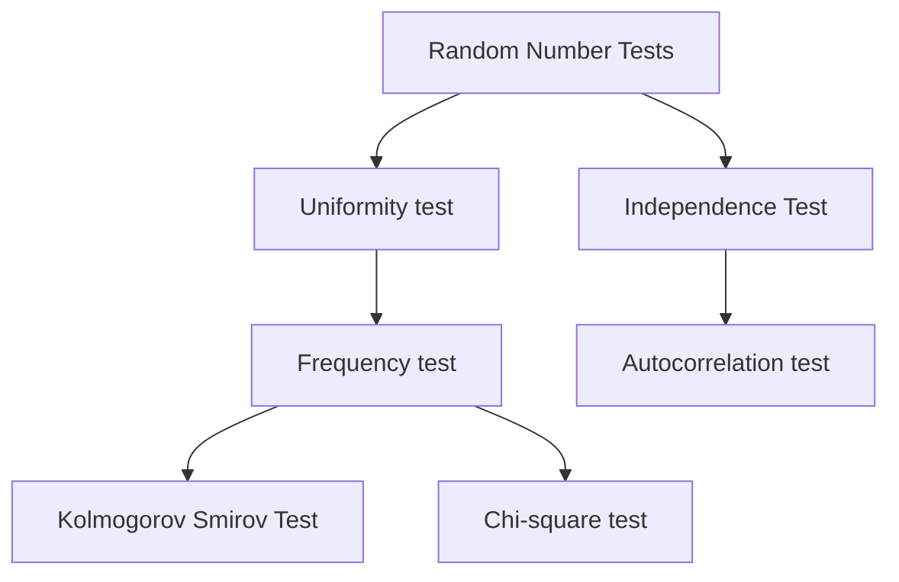

## Unit 5: Random Numbers

> *Qn. Define random numbers and describe why random numbers generated by computer are called pseudo random numbers*

**Random Numbers:**
They are samples drawn from a uniformly distributed random variable between some satisfied intervals, they have equal probabilities of occurence.

- A number chosen from some specified distribution randomly such  that selection of large set of those numbers reproduce the underlying distribution is called random number.
---
#### Types of Random Numbers
1. Truly Random Numbers
2. Pseudo Random Numbers

In computer random numbers are derived from a known starting point and is typically repeated ever and ever using some known algos to produce a sequence of numbers. The sequence of numbers are not completely random as the set of random numbers can be replicated because of use of some known methods. So, the random numbers generated by computers are called pseudo-random numbers.

Every new numbers is generated from the previous ones by an algorithm. This means that the new value is fully determined by the previous ones. 

<div align="center">
    
</div>

A pseudo-random numer generated is an algo for generating a sequence of  numbers whose properties approximates the properties of sequence of random numbers. The sequence is not truly random, but is deterministic because it is completely determined by the initial value called seed.

> Qn. Differentiate between true and pseudo-random numbers. What are the basic properties of random numbers?

#### True and Pseudo Random Numbers

| **Pseudo Random Numbers** | **True Random Numbers** |
|-----------------------|---------------------|
| Pseudo random numbers are the random numbers that are generated by using some known algos, so as to produce a sequence of numbers on $[0, 1]$ that can simulate the ideal properties of random numbers.| True random numbers are gained from physical processes like radioactive decay or also rolling a dice and introduce it to a computer |
| Number generation is fast | Comparatively slow |
| Sequence of numbers can be reproduced | Can't be reproduced |
| Sequence of numbers are repeated for sure| Will or will not repeat |
---
#### Properties of Random Numbers

1. Uniformity 
2. Independence
3. Max Density
4. Max Cycle

**Uniformity**:

The random numbers generated should be uniform that means a sequence of random numbers should be equally probable everywhere.

**Independence**:

Each random number should be independent sample drawn from a continuous uniform distribution between $0$ and $1$.

The probaility density function is given by:
```math
f(x) =
\begin{cases} 
1 & \text{if } 0 \le x \le 1 \\
0 & \text{otherwise}
\end{cases}
```

**Max Density**:

The large samples of random numbers should be generated in a given image.

**Max Cycle**:

It states that the repetition of numbers should be allowed only after a large interval of time. 

---
#### Uses of Random Numbers:
1. Science and Technology
2. Art 
3. Gaming
4. Gambling 
5. Cryptography
---
#### Some Common techniques to generate pseudo-random numbers:

1. Mid Square Method
2. Linear Congruential: $x_n = a x_{n-1} + C (\text{mod} \space m)$
3. Implicit Inversive Congruential: $x_n = \bar{ax_{n-1}} + C (\text{mod} \space p)$
4. Shift Register:
$$y_n = y_{n-s} + y_{n-r} (\text{mod} \space 2); r> s$$
5. Additive lagged-fibonacci:
$$Z_n = Z_{n-s} + Z_{n-r}(\text{mod} \space 2^k ); r>s$$
6. Combined: $w_n = y_n + Z_n \mod (p)$
7. Multiplicative lagged-fibonacci:
$$x_n = x_{n-s} * x_{n-r}(\text{mod} \space 2^k); r>s$$
---
#### Pseudo-Random Number Generation (PRNG):

1. **Mid Square Method:**

    It was given by **John Von Newmann and Metropolis in 1940**.

    ***Algorithm:***
    - Take any integer *(seed)* of say a two or four digit number.
    - Sqaure it and pick the middle two digits *(or four)* and discard the rest.
    - Now again square the selected middle two digits in the previous step.
    - Repeat

    ***Example 1:***
    | S.N. | Random Numbers | Square | Mid Digits |
    |------|----------------|--------|------------|
    |1 | 11 *(seed)* | 0 12 1 | 12 |
    |2 | 12 | 0 14 4 | 14 |
    |3 | 14 | 0 19 6 | 19 |
    |4 | 19 | 0 36 1 | 36 |
    |5 | 36 | 1 29 6 | 29 |
    |6 | 29 | 0 84 1 | 84 |
    | 7| 84 | 7 05 6 | 05 |
    | 8| 05 | 0 02 5 | 02 |
    | 9| 02 | 0 00 4 | 00 |
    |10| 00 | 0 00 0 | 00 |

    Mid Square Method *(Four Digits)*
    1. Start with a $4$- digit number $Z_0$ *(seed).*
    2. Square it to obtain $8$ - digit *(if necessary append zeros to the left)*.
    3. Take the middle $4$- digit to obtain the next $4$-digit number $Z_1$
    4. Then Square $Z_1$ and take the middle $4$- digit again and so on.
    5. We get unifor random number by placing the decimal points at the left of each $Z_i$.

    ***Example 2:*** (Mid-Square Method- *PRNG*)  

    | SN  | Random Numbers | Square     | Mid Digits |
    |-----|----------------|------------|------------|
    | 1   | 7182 *(seed)*  | 51581124   | 5811       |
    | 2   | 5811           | 33767721   | 7677       |
    | 3   | 7677           | 58936329   | 9363       |
    | 4   | 9363           | 87665769   | 6657       |
    | 5   | 6657           | 44315649   | 3156       |
    | 6   | 3156           | 09960336   | 9603       |
    | 7   | 9603           | 92217609   | 2176       |
    | 8   | 2176           | 04734976   | 7349       |
    | 9   | 7349           | 54007801   | 0078       |
    | 10  | 0078           | 00006084   | 0060       |
    | 11  | 0060           | 00003600   | 0036       |
    | 12  | 0036           | 00001296   | 0012       |
    | 13  | 0012           | 00000144   | 0001       |
    | 14  | 0001           | 00000001   | 0000       |


2. **Linear Congruential Method:**
> By D.H. Lebmer

- To produce a sequence of integers $X_1$, $X_2 ... $ between $0$ and $(m -1)$ by following a recursive relationship.

> ***Recursive Relationship***:
> $$ X_{i+1} = (ax_i + c) \mod m ; \space i= 0, 1, 2 ...$$

- Assumption: $m > 0$ and $a < m$, $c< m$, $x_0 < m$.

- The selection of the values for $a,c,m$ and $x_0$ drastically affects the stastical properties and the cycle length

- The random integers $x_i$ are being generated in $[ 0, m-1]$

2. **PRNG Using Linear Congruential Method:**

    1. We can generate random numbers from random integers $X_i$ of the LCM by:
    $$X_{i+1}= (ax_i +c)\mod m ; i = 0,1,2,3 ...$$

    2. Convert the integer $X_i$ to random numbers:
    $$R_i = \frac{X_i}{m}; i = 1,2, 3 ...$$

    ***Example:***

    1. Generate Random numbers with following data:

    $
    X_0=0; a=5 ; c=3 \space \& \space m=7
    $
    
    ***Answer:***

    For $i = 0$
    $$X_{i+1} = (ax_i + c)\mod m$$

    $$X_1 = (aX_0 + c)\mod m \\ =(5\times 0 + 3) \mod 7 \\ = 3$$

    $$\therefore R_1 = \frac{X_1}{m} = \frac{3}{7} = 0.43$$

    For $i = 1$
    $$X_2 = (aX_1 + c)\mod m \\ =(5\times 3 + 3) \mod 7 \\ = 4$$

    $$\therefore R_2 = \frac{X_2}{m} = \frac{4}{7} = 0.57$$

    For $i = 2$
    $$X_3 = (aX_2 + c)\mod m \\ =(5\times 4 + 3) \mod 7 \\ = 2$$

    $$\therefore R_3 = \frac{X_3}{m} = \frac{2}{7} = 0.29$$

    For $i = 3$
    $$X_4 = (aX_3 + c)\mod m \\ =(5\times 2 + 3) \mod 7 \\ = 6$$

    $$\therefore R_4 = \frac{X_4}{m} = \frac{6}{7} = 0.86$$

    For $i = 4$
    $$X_5 = (aX_4 + c)\mod m \\ =(5\times 6 + 3) \mod 7 \\ = 5$$

    $$\therefore R_5 = \frac{X_5}{m} = \frac{5}{7} = 0.714$$

    For $i = 5$
    $$X_6 = (aX_5 + c)\mod m \\ =(5\times 5 + 3) \mod 7 \\ = 0$$

    $$\therefore R_6 = \frac{X_6}{m} = \frac{0}{7} = 0$$

#### Text from Random Numbers

The desired properties of random numbers are:
1. Uniformity
2. Independence can be checked or achieved by number of texts that can be peformed on generated random numbers.
    The test can be placed into two categories according to the ideal properties of randomness.



> **Kolmogorov and Chi-Square tests** are used to compare the distribution of set of number generated to uniform distribution.

> **Autocorrelation Test** is used to test the correlation between numbers and compare the sample, correlation of the expected correlation zero.

#### Frequency Test:
It is a basic test that should always be performed to validate a new generation for uniform distribution of random number integer.
Two different testing are available:

1. **KS Test** ***(Kolmogorov Smirov Test)***:
2. **Chi Square Test**

Both of these test measure the degree of agreement between the distribution of samples of generated random numbers and the theoritical uniform distribution.

---
#### Test Used For KS Test
In testing for uniformity, the hypothesis are as follows:

$H_0: R_i \sim  U[0,1] \longrightarrow \text{Every random numbers is unformly distributive}$

$H_1: R_i \nsim U[0,1] \longrightarrow \text{Not uniformly distributed}$

The null hypothesis $H_0$, reads that the numbers are distributed uniformly on the interval $[0,1]$. Failure to reject null hypothesis means that the evidence of non uniformly has been detected by the test.

##### Level of significance:
For each test, a level of significance, i.e., '$\alpha$' must be stated. The '$\alpha$' is probability of rejecting the null hypothesis when the null hypothesis is true.

$$\alpha = \text{P}[\text{reject} \space H_0 | H_0 \space \text{true}]$$

The decision maker sets the value of $\alpha$ for any frequency '$\alpha$' is set to $0.01$ or $0.05$.

The following steps shows **KS-Test** procedure for testing against a uniform-cdf $\longrightarrow$ cummulative distribution function.

---
***Step 1:***
Rank the data from smallest to largest

Let $R_i$ denote the $\text{i}^\text{th}$ smallest observation so that:
$$R_{(1)} \leq R_{(2)} \leq R_{(3)} \leq ... \leq R_{(n)}$$

---
***Step 2:*** Compute:

```math
D^+ = \max_{1 \leq i \leq N} \left\{ \dfrac{i}{N} - R(i) \right\}
```

```math
D^+ \text{ is the largest deviation of } S_N(X) \text{ above } F(X)
```

```math
S_N(X) = \frac{\text{No. of } A_1, A_2, \dots, A_N \leq X}{N}
```

```math
D^- = \max_{1 \leq i \leq N} \left\{ R(i) - \frac{i-1}{N} \right\}
```

```math
D^- \text{ is the largest deviation of } S_N(X) \text{ below } F(X)
```

---
***Step 3***:
Compare $D = \text{max}(D^+, D^-)$

where '$D$' is largest standard deviation between uniform distribution and emperical distribution ie., *observation*

---

***Step 4***:
Locate the critical value $D_\alpha$ for the specified level of significance $\alpha$ and given sample size $N$.

---
***Step 5***:
If the sample statistic $D$ is greater than the critical value $D_\alpha$, then the null hypothesis for the sample data is rejected.

---
##### ***Question***:
Suppose 5 numbers are given: $0.44, 0.81, 0.14, 0.05, 0.93$. Test for uniformity using the K-S test with a level of significance $\alpha = 0.05$.

### Solution:

**Step 1:** Arrange the numbers in ascending order:

$$
\begin{array}{c|ccccc}  
R_i & 0.05 & 0.14 & 0.44 & 0.81 & 0.93  
\end{array}
$$

Given: $N = 5$, $\alpha = 0.05$

**Step 2:** Calculate $\frac{j}{N}$ for each $j$, where $S_n(x) = \frac{j}{N}$

$$
S_n(x) = \frac{\text{No. of } R_1, R_2, \dots \text{ where } R_j \leq x}{N}
$$

- (i) $\frac{j}{N} = \frac{1}{5} = 0.20$
- (ii) $\frac{j}{N} = \frac{2}{5} = 0.40$
- (iii) $\frac{j}{N} = \frac{3}{5} = 0.60$
- (iv) $\frac{j}{N} = \frac{4}{5} = 0.80$
- (v) $\frac{j}{N} = \frac{5}{5} = 1.00$

**Step 3:** Compute $D^+$ and $D^-$ for each $j$

$$
D^+ = \max_j \left( \frac{j}{N} - R_j \right), \quad D^- = \max_j \left( R_j - \frac{j-1}{N} \right)
$$

Calculations:

- For $j = 1$:
  - $D^+ = 0.20 - 0.05 = 0.15$
  - $D^- = 0.05 - \frac{0}{5} = 0.05$

- For $j = 2$:
  - $D^+ = 0.40 - 0.14 = 0.26$
  - $D^- = 0.14 - \frac{1}{5} = 0.14 - 0.20 = -0.06$

- For $j = 3$:
  - $D^+ = 0.60 - 0.44 = 0.16$
  - $D^- = 0.44 - \frac{2}{5} = 0.44 - 0.40 = 0.04$

- For $j = 4$:
  - $D^+ = 0.80 - 0.81 = -0.01$
  - $D^- = 0.81 - \frac{3}{5} = 0.81 - 0.60 = 0.21$

- For $j = 5$:
  - $D^+ = 1.00 - 0.93 = 0.07$
  - $D^- = 0.93 - \frac{4}{5} = 0.93 - 0.80 = 0.13$

**Table with $D^+$ and $D^-$:**

| $R_i$   | $0.05$ | $0.14$ | $0.44$ | $0.81$ | $0.93$ |
|---------|--------|--------|--------|--------|--------|
| $\dfrac{j}{N}$  | $0.20$ | $0.40$ | $0.60$ | $0.80$ | $1.00$ |
| $D^{+}$   | $0.15$ | $0.26$ | $0.16$ | $-0.01$ | $0.07$ |
| $D^{-}$   | $0.05$ | $-0.06$  | $0.04$  | $0.21$ | $0.13$ |

**Step 4:** Calculate the K-S statistic $D$

$$
D = \max(|D^+|, |D^-|) = \max(0.15, 0.26, 0.16, 0.07, 0.05, 0.04, 0.21, 0.13) = 0.26
$$

**Step 5:** Compare with the critical value $D_{\alpha}$

For $N = 5$ and $\alpha = 0.05$, $D_{0.05, 5} = 0.563$

Since $0.26 < 0.563$, we fail to reject the null hypothesis.

**Conclusion:**

The generated random numbers are uniformly distributed between 0 and 1 at the 0.05 level of significance.

---

> ***Assignment***: The sequence of random numbers $0.54, 0.73, 0.93, 0.11$, and $0.68$ has been generated. Use the Kolmogorov-Smirnov test with $\alpha = 0.05$. Test whether the hypothesis that the numbers are uniformly distributed on the interval $[0,1]$ can be rejected.
>
> ### Solution:
>
> **Step 1:** Arrange the numbers in ascending order:
>
> $$
> \begin{array}{c|ccccc}  
> R_i & 0.11 & 0.54 & 0.68 & 0.73 & 0.93  
> \end{array}
> $$
>
> Given: $N = 5$, $\alpha = 0.05$
>
> **Step 2:** Calculate $\frac{j}{N}$ for each $j$:
>
> - (i) $\frac{j}{N} = \frac{1}{5} = 0.20$
> - (ii) $\frac{j}{N} = \frac{2}{5} = 0.40$
> - (iii) $\frac{j}{N} = \frac{3}{5} = 0.60$
> - (iv) $\frac{j}{N} = \frac{4}{5} = 0.80$
> - (v) $\frac{j}{N} = \frac{5}{5} = 1.00$
>
> **Step 3:** Compute $D^+$ and $D^-$ for each $j$:
>
> - For $j = 1$:
>   - $D^+ = 0.20 - 0.11 = 0.09$
>   - $D^- = 0.11 - \frac{0}{5} = 0.11$
>
> - For $j = 2$:
>   - $D^+ = 0.40 - 0.54 = -0.14$
>   - $D^- = 0.54 - \frac{1}{5} = 0.54 - 0.20 = 0.34$
>
> - For $j = 3$:
>   - $D^+ = 0.60 - 0.68 = -0.08$
>   - $D^- = 0.68 - \frac{2}{5} = 0.68 - 0.40 = 0.28$
>
> - For $j = 4$:
>   - $D^+ = 0.80 - 0.73 = 0.07$
>   - $D^- = 0.73 - \frac{3}{5} = 0.73 - 0.60 = 0.13$
>
> - For $j = 5$:
>   - $D^+ = 1.00 - 0.93 = 0.07$
>   - $D^- = 0.93 - \frac{4}{5} = 0.93 - 0.80 = 0.13$
>
> **Table with $D^+$ and $D^-$:**
>
> | $R_i$   | $0.11$ | $0.54$ | $0.68$ | $0.73$ | $0.93$ |
> |---------|--------|--------|--------|--------|--------|
> | $\dfrac{j}{N}$  | $0.20$ | $0.40$ | $0.60$ | $0.80$ | $1.00$ |
> | $D^{+}$   | $0.09$ | $-0.14$ | $-0.08$ | $0.07$ | $0.07$ |
> | $D^{-}$   | $0.11$ | $0.34$  | $0.28$  | $0.13$ | $0.13$ |
>
> **Step 4:** Calculate the K-S statistic $D$:
>
> $$
> D = \max(|D^+|, |D^-|) = \max(0.09, 0.14, 0.08, 0.07, 0.07, 0.11, 0.34, 0.28, 0.13, 0.13) = 0.34
> $$
>
> **Step 5:** Compare with the critical value $D_{\alpha}$:
>
> For $N = 5$ and $\alpha = 0.05$, $D_{0.05, 5} = 0.563$
>
> Since $0.34 < 0.563$, we fail to reject the null hypothesis.
>
> **Conclusion:**
>
> The hypothesis that the numbers are uniformly distributed on $[0,1]$ cannot be rejected at the $0.05$ level of significance.

