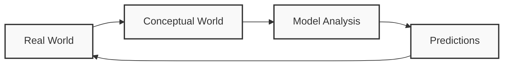
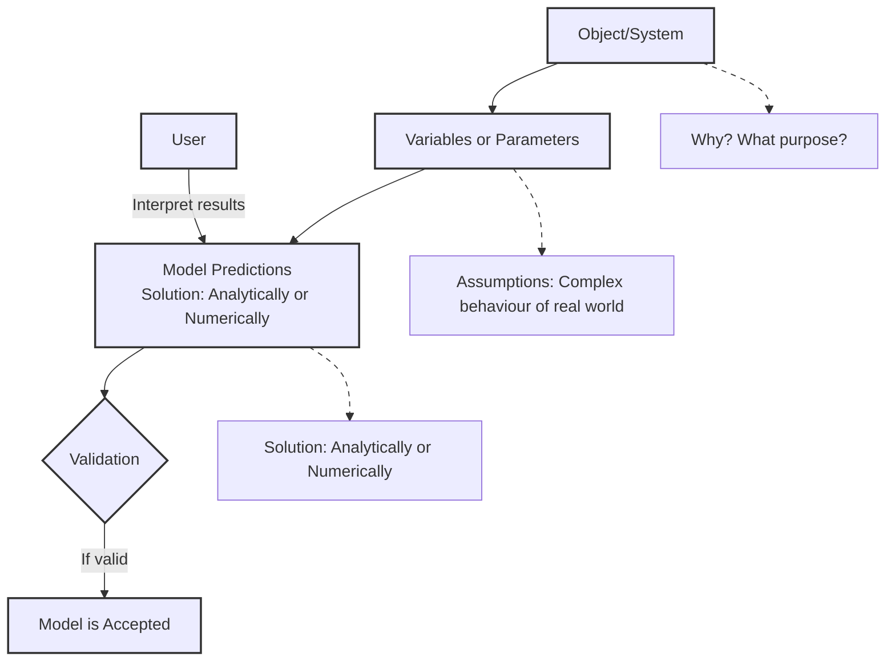

# Unit 1: Introduction to Simulation

## Simulation  
The process of designing a mathematical or logical model of a real system and then conducting computer-based experiments with the model to describe, explain, and predict the behavior of the real system.

## System  
A group of objects that are joined together in some regular interactions or interdependencies towards the accomplishment of a specific goal.

### Components of a System  
1. Entity  
2. Attribute  
3. Activity  
4. State  
5. Event  
   - **Endogenous**: arising from internal structure or functional cause  
   - **Exogenous**: having an external cause or origin  

## System Environment  
Changes occurring outside the system.

## General Simulation Language  
1. **GPS**  
   - Block structure language  
   - Interpreting execution  
   - FORTRAN-based (helps to create blocks)  
   - World View: transactions/facilities  

2. **SIMScript 11.5**  
   - English-like problem descriptive language  
   - Compiled programs  
   - Complete language (no other underlying language)  
   - World View: processes, resources  

3. **MODSIM III Modern Object-Oriented Language**  
   - Modular, compiled program  
   - Based on Modula-2  
   - World View: processes  

4. **SIMULA**  
   - ALGOL-based problem descriptive language  
   - Compiled programs  
   - World View: processes  

5. **SLAM Block-Based Language**  
   - Interpretive execution  
   - FORTRAN-based (and extended)  
   - World View: network/event/process  

6. **CSIM**  
   - Process-oriented language  
   - C-based (C++ compatible)  
   - World View: processes  

## Examples of systems and Components

System|Entity|Attribute|Activities|Events|State Variables|
------|------|---------|----------|------|---------------|
Banking|Customer|Account Balance|Making Deposit|Arrival and Departure|Number of customers waiting|

## Types of System
1. Discrete System
2. Continuous System

### Discrete System 
- State variables change only at a discrete set of points in time

   Example: Bank -> The number of csutomers changes only when a customer arrives or when the service provided to the customer is completed.

### Continuous System 
- State variables change continuously over time

   Example: Head of the water behind a dam

## Model 
- A representation of a system for the purpose of studying the system 
- A simplification of the system 
- Sufficiently detailed to permit valid conclusions to be drawn about the real system

### Types of Model
**1. Static or Dynamic Simulation Models**

- Static Simulation Model (called Monte Carlo Simulation) represents a system at a particular point in time

- Dynamic Simulation Models represent systems as they change over time

**2. Deterministic and Stoichastic Simulation Models**

- Deterministic Simulation Models contain no random variables and have a known set of inputs which will result in a unique set of outputs.

- Stoichastic Simulation Models have one or more random varibales as inputs. Random input lead to random output. 

## Model of a system
A model is defined as a representation of a system for the purpose os studying the system.  
The various types of models are:
- Mathematical Model ot Physical Model
- Static Model
- Dynamic Model
- Deterministic Models
- Stoichastic Model 
- Discrete Model

### 1. Mathemtical Model 
Use symbolic notation and the mathematical equations to represent a system  

### 2. Static Model  
Represents a system at a particular point of time and also known as Monte-Carlo Simulation

### 3. Dynamic Model 
Represents systems as they change over time. Example: Simulation of a bank  

### 4. Deterministic Model
Contains no random variables. They have a known set of inputs which will result in a unique set of outputs. 
Example: Arrival of patients at a Dentist at the scheduled appointment time.

### 5. Stoichastic Model 
Has one or more random variables as input.  
Random inputs lead to random output.  
Example: Simulation of a block involves random interarrival and service time.  

### 6. Discrete Event Simulation
Modelling of a system in which the state variables changes only at a discrete set of points in time.    
THe simulation models are analyzed by numerical rather than by analytical methods.

## The Modelling Cycle

## Principles of Mathematical Model

## Applications of Simulation
- Epidemology
- Biological Transport
- Vehicular traffic
- Optimal Stratagies in business
- Economic
- Financial Industry
- Engineering
- Software Development

