# Unit 1: Introduction to Simulation

## Simulation  
The process of designing a mathematical or logical model of a real system and then conducting computer-based experiments with the model to describe, explain, and predict the behavior of the real system.

## System  
A group of objects that are joined together in some regular interactions or interdependencies towards the accomplishment of a specific goal.

### Components of a System  
1. Entity  
2. Attribute  
3. Activity  
4. State  
5. Event  
   - **Endogenous**: arising from internal structure or functional cause  
   - **Exogenous**: having an external cause or origin  

## System Environment  
Changes occurring outside the system.

## General Simulation Language  
1. **GPS**  
   - Block structure language  
   - Interpreting execution  
   - FORTRAN-based (helps to create blocks)  
   - World View: transactions/facilities  

2. **SIMScript 11.5**  
   - English-like problem descriptive language  
   - Compiled programs  
   - Complete language (no other underlying language)  
   - World View: processes, resources  

3. **MODSIM III Modern Object-Oriented Language**  
   - Modular, compiled program  
   - Based on Modula-2  
   - World View: processes  

4. **SIMULA**  
   - ALGOL-based problem descriptive language  
   - Compiled programs  
   - World View: processes  

5. **SLAM Block-Based Language**  
   - Interpretive execution  
   - FORTRAN-based (and extended)  
   - World View: network/event/process  

6. **CSIM**  
   - Process-oriented language  
   - C-based (C++ compatible)  
   - World View: processes  


## Examples of systems and Components

System|Entity|Attribute|Activities|Events|State Variables|
------|------|---------|----------|------|---------------|
Banking|Customer|Account Balance|Making Deposit|Arrival and Departure|Number of customers waiting|

## Types of System
1. Discrete System
2. Continuous System

### Discrete System 
- State variables change only at a discrete set of points in time

   Example: Bank -> The number of csutomers changes only when a customer arrives or when the service provided to the customer is completed.

### Continuous System 
- State variables change continuously over time

   Example: Head of the water behind a dam


## Model 
- A representation of a system for the purpose of studying the system 
- A simplification of the system 
- Sufficiently detailed to permit valid conclusions to be drawn about the real system

### Types of Model
**1. Static or Dynamic Simulation Models**

- Static Simulation Model (called Monte Carlo Simulation) represents a system at a particular point in time

- Dynamic Simulation Models represent systems as they change over time

**2. Deterministic and Stoichastic Simulation Models**

- Deterministic Simulation Models contain no random variables and have a known set of inputs which will result in a unique set of outputs.

- Stoichastic Simulation Models have one or more random varibales as inputs. Random input lead to random output. 


## Model of a system
A model is defined as a representation of a system for the purpose os studying the system.  
The various types of models are:
- Mathematical Model ot Physical Model
- Static Model
- Dynamic Model
- Deterministic Models
- Stoichastic Model 
- Discrete Model

### 1. Mathemtical Model 
Use symbolic notation and the mathematical equations to represent a system  

### 2. Static Model  
Represents a system at a particular point of time and also known as Monte-Carlo Simulation

### 3. Dynamic Model 
Represents systems as they change over time. Example: Simulation of a bank  

### 4. Deterministic Model
Contains no random variables. They have a known set of inputs which will result in a unique set of outputs. 
Example: Arrival of patients at a Dentist at the scheduled appointment time.

### 5. Stoichastic Model 
Has one or more random variables as input.  
Random inputs lead to random output.  
Example: Simulation of a block involves random interarrival and service time.  

### 6. Discrete Event Simulation
Modelling of a system in which the state variables changes only at a discrete set of points in time.    
THe simulation models are analyzed by numerical rather than by analytical methods.

## The Modelling Cycle


## Principles of Mathematical Model


## Applications of Simulation
- Epidemiology
- Biological Transport
- Vehicular traffic
- Optimal Strategies in business
- Economic
- Financial Industry
- Engineering
- Software Development

## Phases/Steps in Simulation Study


## Summary-Simulation Study Steps

1. Problem Formulation  
a. Define the problem  
b. Define the system  
c. Establish performance metrics  
d. Build conceptual model  
e. Document model assumptions

2. Simulation Model Building  
a. Model translation  
b. Input data modelling  
c. Verification  
d. Validation  

3. Experimental Design and Analysis  
a. Preliminary runs  
b. Final experiments  
c. Analysis of results  

4. Evaluate and Iterate  
a. Documentation  
b. Model manual  
c. User manual  

5. Implementation  
Puts to the production of simulation


## Use of Differential and Partial Differential Equation in Modeling:

### **Modeling:**
- A mathematical model is an expression involving variables, functions or equations that represents a real-world phenomenon.
- The purpose of a model is to understand a certain phenomenon and to make predictions about the future behaviour or outcomes of a system, event or quantity.
- The figure below illustrates the modeling process:

---

**_Example 1:_ RadioActive Decay**

Experiment shows that at each instant a radio-active substance decomposes, the rate of decomposition is propotional to the amount of substance present. Given a certain initial amount of a radioactive substance present at any time later.
```math
\text{Let, y = amount of substance present at any given time} \\
\text{y}_0 = \text{initial amount of substance} \\ \space \frac{\text{dy}}{\text{dt}} \space \alpha \space \text{y} \\
\text{Working Equation:} \space
\frac{\text{dy}}{\text{dt}} = -k\text{y}; \text{where} \space k \space \text{is propotionality decay constant}
```
<div align= "center">
   
   <p><b>Fig 01:</b><i> Diagram illustrating Radioactive decay</i></p>
</div>

---
**_Example 2:_ A freely falling body**

An object is falling under the influence of gravity as it falls downward. It is subjected to air resistance that creates an upward force propotional to the velocity of object. Obtain the differential equation that describes the velocity and the position of the object at any given time. Assume that the mass of body as $m$
and acceleration due to gravity $g$ — which is constant throughout the planet.

<div align="center">
   
   <p><b>Fig 02:</b> <i>Example_2 diagram</i></p>
</div>

Applying relevant physical law; **Newtons Law of acceleration**:_(2nd Law)_
```math
F_{net} = ma
```
Substituting forces:
```math
mg- kv = ma
```
Then, substiuting $a$ with $\frac{dv}{dt}$; we get:

```math
mg - kv = m \frac{dv}{dt}
```

Rearranging terms:
Dividing through by $m$:
```math
g- \frac{k}{m} v= \frac{dv}{dt}
```
On reagrranging: we get
```math
\frac{dv}{dt} + \frac{k}{m} v = g
```
This represents the first order diffrential equation.

Likewise, the second order differential equation would look like:
```math
\frac{dv^2}{dt^2} + \frac{k}{m} \frac{dy}{dt} = g
```
---
**_Example 3:_** RL Circuit

A series RL circuit connected in a voltage source $V$ develops a model of circuit describing the circuit at any time $ t > 0$

<div align="center">
   
   <p><b>Fig 03:</b><i> RL Circuit</i></p>
</div>

Kirchoff's Voltage Law (KVL):
```math
V- iR - L \frac{di}{dt} = 0 \\  
or, L \frac{di}{dt} + iR = V \\  
or \frac{di}{dt} + \frac{R}{L}i = \frac{V}{L}  
```
describes current at any time t and is a **differential equation of first degree.**


## Simulation Software

- [Arena](www.arenasimulation.com)
- [Automod](www.automod.com)
- [Delmia/Quest](www.delmia.com)
- [Extend](www.rockwellautomation.com/en-us/products/software/extend-simulations)
- [Flexim](www.flexsim.com)
- [MicroSim](www.microsim.com)
- [ProModel](www.promodel.com)
- [Simula](www.simula.no)
- [WITNESS](www.lanner.com/products/witness) 


# Unit 2: Simulation of Continuous and Discrete Systems

## Continuous Function Illustration
```
         f(x)
           |
         9 |                *
           |             *
         4 |          * 
           |       *
         1 |    *
           |  *
         0 +------------------> x
            0   1   2   3   4
```

## Discrete System Illustration
```
    y[n]
     |
  10|        *       *       *       *
     |
    8|    *       *       *       *
     |
    6|       *       *       *
     |
    4| *       *       *       *
     |
    2|   *       *       *
     +----------------------------------> n
        0   1   2   3   4   5   6   7
```
---

## Analog Method of System Simulation
- Analog computers are those computers that are unified with devices like adder and integral so as to simulate the continuous mathematical model of the system which generates continuous output.
- Analog method of system simulation is for use of analog computers and other analog devices in the simulation of continuous systems.
- The analog computation is sometimes called differential analyzer. Electronics analog computers for simulation are based on the use of high gain dc amplifiers called operational amplifiers. (Op-amps)
- In such analog computers, voltages are equated to mathematical variables and the op-amps can add and integrate these voltages.
- The proper configuration can handle addition of several input voltages each representing the input variables.
- The general method to apply analog computers for the simulation of continuous system models involve following components:


    > #### Integrator
    ```
        +--------+
    --->|   ∫    | --->
        +--------+
    ```

    > #### Summer (Three Instances)
    ```
        +-----------+
    --->|           |
    --->|     Σ     | --->
    --->|           |
        +-----------+
    ```

    > #### Differentiator
    ```
        +-----------+
    --->|   d/dt    | --->
        +-----------+
    ```

    > #### Inverter
    ```
        +-----------+
    --->|     -     | --->
        +-----------+
    ```

    > #### Multiplier
    ```
        +-----------+
    --->| A         |
        |     ×     |--->
    --->| B         |
        +-----------+
    ```

    > #### Divider
    ```
        +-----------+
    --->|A          |
        |     ÷     |--->
    --->|B          |
        +-----------+
    ```
    ---

    ***Example : Automatic Suspension Problem***

    The general method by which analog computers are applied can be demonstrated by the second order differential equation
    ``` math
    Mx'' + Dx' + Kx = KF(t)
    ```
    Solving the equation for the highest order derivative gives
    ``` math
    Mx'' = KF(t) - Dx' - Kx
    ```
    <div align="center">
        
        <p><b>Fig: </b><i>Automobile Suspension System</i></p>
    </div>

    

    Suppose a variable representing the input `F(t)` is supplied, assume there exists variables representing `-x`, `x'`. These three variables can be scaled and added to produce `Mx''`. Integrating it with a scale factor `1/M` produces `x'`. Changing sign produces `-x'`, further integrating produces `-x`, a further sign inverter is included to produce `+x` as an output.
---


## Continuous System Models
- A continuous system is one in which the predominant activities of the system cause smooth changes in the attributes of the system entities. 
- When such a system is modelled mathematically the variables of the model representing the attributes are controlled by the continuous system.
- More generally in a continuous system the relationship describes the rate at which the variables representing the attributes change, so that the model circuit of differential equation. 
---

## Differential and partial differential equation

> ### Differential Equation:
- A differential equation is an equation involving an unknown function and its derivative.
- The order of the differential equation is the order of the highest derivative of the unknown function involved in the equation.
```math
\frac{dy}{dt} = f(y,t) ...........................\text{(i)}
```
---

> ### Linear Differential Equation
- A linear differential equation of order `n` is a differential equation written in the following form.
    ```math
    a_n(x) d_n \frac{y}{dx^n} + a_{(n-1)}(x) + \frac{d_{(n-1)}(y)}{dx^(n-1)} + ... +a_1(x) \frac{dy}{dx}+ a_0(x)y = f(x)
    ```

    where `a_n(x), a_(n-1)(x), a_1(x), a_0(x)` are functions of `x` and `f(x)` is a function of `x`.
--- 

> ### Partial Differential Equation
- When more than one independent variable occur in a differential equation the equation is said to be partial differential equation.

    ***Example***:
    - An equation describing the flow of heat in a three-dimensional body. There are four independent variables, representing the three dimensions and time and one dependent variable representing temperatures.

    - The general heat conduction equation:
``` math
        \frac{d}{dx}(k.(\frac{dT}{dx})) + \frac{d}{dy}(k.(\frac{dT}{dy})) + \frac{d}{dz}(k.(\frac{dT}{dz})) + qv = \rho \space C_p \frac{dT}{dt}
```
- where k is the material conductivity.
- $qv$ is the rate at which energy is generated per unit volume of the medium.
- $\rho$ is the density
- $C_p$ is the specific heat capacity.

    This equation is also known as the Fourier-Biot equation and provides the basic tool for heat conduction analysis.
---

## Interactive and Feedback System in Simulation

> ### Interactive Systems
- Interactive Systems are the computer systems characterized by significant amount of interaction between humans and the computer. Macintosh and Windows computer operating systems are prime examples of graphical interactive systems.

- Editors, CAD-CAM(Computer Aided Design - Computer Aided Manufacture) system, and data entry systems are all computer systems involving a high degree of human - computer interaction. Games and simulations are interactive systems. Web browsers and integrated development environments (IDE) are also examples of very complex interactive systems.

> ### Feedback Systems
The system takes feedback from the output i.e input is coupled with output. A significant factor in the performance of many systems is that coupling occurs between the input and output of the system. The term feedback is used to describe the phenomenon.  
    The example of feedback system in which there is continuous controlin the aircraft system.

```mermaid
graph LR
    G(Gyroscope)
    C(Control Surface)
    A(Air Frames)
    
    G-->|"ε"|C-->A-->G
```



Here, the input is the **desired aircraft heading**, and the output is the **actual heading**. The gyroscope of the autopilot detects the difference between the two headings.

A **feedback loop** is established by using this difference to operate the control surface. Since the change in heading affects the signal used to control the heading, the difference between the desired signal $Q_t$ and the actual heading $Q_0$ is called the **error signal**.  

Since it measures the extent to which the system deviates from the desired condition, it is denoted by 
𝜖.

$$
\epsilon = Q_t - Q_0
$$

The torque acting on the system is given by:

$$
\text{Torque} = K\epsilon - D Q_0'
$$

Since we also know that torque is related to angular acceleration as:

$$
\text{Torque} = I Q_0''
$$

From equations (1), (2), and (3), we obtain:

$$
I Q_0'' + D Q_0' + K Q_0 = K Q_t \quad \text{(Equation 4)}
$$


$$Torque = K\epsilon - DQ_0'$$
$$IQ_0'' = K(Q_t - Q_0) - DQ_0'$$
$$IQ_0'' = KQ_t-KQ_0-DQ_0'$$
$$IQ_0''+DQ_0+KQ_0 = KQ_t$$


Dividing both sides by \( I \) and making the following substitutions:

$$
2E\omega = \frac{D}{I}, \quad \omega^2 = \frac{K}{I}
$$

We rewrite Equation (4) as:

$$
Q_0'' + \frac{D}{I} Q_0' + \frac{K}{I} Q_0 = \frac{K}{I} Q_t
$$

Substituting the defined parameters:

$$
Q_0'' + 2E\omega Q_0' + \omega^2 Q_0 = \omega^2 Q_t \quad \text{(Equation 5)}
$$

where \( E \) is the **damping factor**.

This is a **second-order differential equation** describing the system's response.


> Q. Explain how do you update the clock time in system simulation.
> #### Clock time in System Simulation
- CLock time is updated based on the following two models. 
        
        - Fixed Time Step Model
        - Event to EVent Model

> Fixed time step model:
- In this, the timer simulated by the computer is updated at a fixed time interval. The system is checked to see if any event has taken place during that interval. All the events which takes place during the time interval are considered to have occured simultaneously at the end of the interval.

> Event-to-Event Model:
- It is also known as the next event model. In this the computer advances the time to the occurence of the next event. So it shifts from one event to the another event and the system state does not change in between. A track of the current time is kept when something interesting happens to the system.  

## Clock time in system simulation
### 1. Fixed Step Model


### 2. Event-to-event Model (Next-Event Simulation)


## Non stationary Possion process and Stationary Poissons Process

### Poissons Process
The non-stationary Poissons process is a Poissons process for which the arrival rate varies with time.  
More specifically it can be defined as follows:  
a. The process has independent increments.  
b. $P_r[N(t+dt)-N(t)]$

$= 0]= 1-$/lambda(t)dt$


Where lambda(t) = the arrival rate at time t  
dt = differential sized interval  

The definition is identiacl to the stationary Poissons process, with the exception that the arrival rate lambda(t) is now a function of time.  
### Stationary Poisson Process
A counting process $N(t)$ is a stationary Poisson process with rate lambda if:  
> a. THe process has independent increments  
> b. The process has stationary increments  
> c. $P_r[N(t+dt)-N(t)]$

bracket wala lekhna Baki  

A non-stationary Poisson process can be transferred into a stationary Poisson process with arrival rate 1.  

## Arrival Pattern
Q. Define arrival pattern. Explain non-stationary Poisson process.  

Arrival defines the way customers enter the system. Mostly the arrivals are random with random intervals between two adjacent arrivals.  
Typically the arrival is described by a random distribution of intervals also called arrival pattern.  
Arrivals may occur at scheduled times or at random times. When at random times, the inter arriva time are usually characterized by a probability distribution and most important model for random arrival i.e. the poisson process. IN schedule arrival interarrival time of customer are constant.


### Non Stationary Poisson Process
The non-stationary poisson process is a poisson process for which the arrival rate varies with time. More specifically, it can be defined as follows:

The counting process `N(t)` is a non-stationary poisson process if
    
- the process has independent increments.
- $P_r[N(t+dt)-N(t)]$ = 


where lambda(t) = arrival rate of time t  
dt = differential sized interval


### *Q. Differentiate between clock time and simulation time used in system simulation.*

| Clock Time | Simulation Time |
|------------|-----------------|
| It is the total amount of time for which the CPU remains active. | It is the total amount of time that CPU spends for simulation. |
| Clock time is measured continuously through all the operations that a CPU undergoes. | Simulation time only deals with the amount of time elevated for simulation. |
| It is usually more. | It is usually less. |

***Example:*** 

Let us take an example where CPU is running for 6 seconds and now it performs a calculation for 0.01 second and stops the calculation, again the CPU runs for 5 more seconds.

So, ***Clock Time*** = ***Total time CPU is active*** = 6 + 5 = 11 seconds

Similarly, ***Simulation Time*** = ***Total time CPU spends for calculation*** = 0.01 seconds

----

## Hybrid Simulation
> *Q. Explain Hybrid simulation with example.*

- In reality, the system is of neither a pure continuous nor a pure discrete nature. For simulating such systems, the combination of analog and digital computers is used. Such setup is known as hybrid Computers.
- The simulation provided by the hybrid computers is known as hybrid simulation.
- The form taken by hybrid simulation depends upon the application. One computer may be simulating the system being studied while other is providing a simulation of the environment in which the system operates.
- It is also possible that the system being simulated is an interconnection of continuous and discrete systems, which can be best modeled by an analog and digital computer being linked together.
- The major difficulty in use of hybrid simulation is it requires high speed converters to transform signals from analog to digital form and vice-versa.
***


## Monte Carlo Simulation
> *Q. Explain Monte Carlo Simulation with example.*

- Monte Carlo simulation is a computerized mathematical technique to generate random sample data based on some known distribution for numerical experiments.
- This method is applied to risk quantitative analysis, decision-making problems. This method is used by the professionals of various profiles like finance, project management, energy, manufacturing, engineering, research and development, insurance, oil & gas, transportation, and many more.
- Following are the three important characteristics of Monte Carlo Simulation:
    - Its output must generate random samples.
    - Its input distribution must be known.
    - Its result must be known while performing an experiment.


<div align="center">
   <p><b>Fig 03:</b><i> Flowchart of Monte Carlo Simulation</i></p>
</div>


***Example:***

Determine the value of *`PI(π)`* using Monte Carlo Simulation.

>>>>>> Diagram Xa haii


$$
\frac{Area of quadrant of circle}{Area of Rectangle} = \frac{Number of points inside the curve}{Number of points inside the rectangle}
$$

$$
or, \frac{\frac{1}{4} * π * r^2}{r^2} = \frac{n}{N}
$$

$$
or, π = \frac{4n}{N}
$$

We use random number generator method to determine the sample points that lie inside or outside the curve. let (x0,y0) be an initial guess for the sample point then from a linear congruential method of random number generation 

$$ 
x_{i+1} = (a*x_i + c) \mod m 
$$

$$ 
y_{i+1} = (a*y_i + c) \mod m 
$$

where a and c are constants, m is the  upper limit of generated random numbers.
$$\text{If } y \leq y_i \text{ then increment } n.$$
